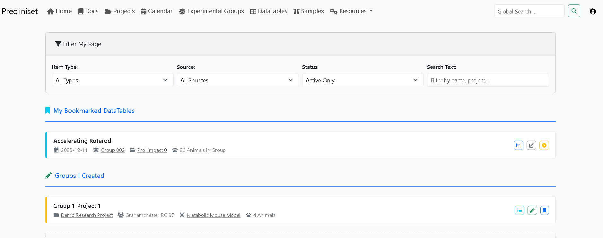

# Precliniset Deployment Guide

This guide covers the **Installation**, **Configuration**, and **Maintenance** of Precliniset for both development and production environments.

Precliniset supports two primary deployment modes:
1.  **Docker Deployment (Recommended)**: Easiest to install and upgrade. Installs everything (DB, Redis, App) in isolated containers.
2.  **Native Deployment (Advanced)**: For servers where you want to run directly on the host OS (Linux/Windows) using Python `venv` and `systemd`.

---

## 🛠️ Quick Start (The "Easy Way")

We provide a unified management tool, `manage.py`, to handle all complex tasks.

### 1. Prerequisites
-   **Python 3.10+** (with `pip` and `venv` modules).
-   **Git** (to download the code).
-   **Docker Desktop** (only if using Docker mode).

> [!TIP]
> **Blank Linux OS (Ubuntu/Debian)?** Run this once to get the essentials:
> `sudo apt update && sudo apt install -y python3-pip python3-venv git`

### 2. Setup Wizard
The first step for ANY deployment is to configure your environment.

```bash
python manage.py setup
```

This interactive wizard will ask you questions to generate a secure `.env` configuration file (based on `.env.example`):
-   **Deployment Mode**: Choose `Docker` or `Native`.
-   **Environment**: `Production` (secure) or `Development` (debug output).
-   **Database**:
    -   *Docker*: Auto-creates an internal container (easiest) OR connects to an external MySQL/MariaDB.
    -   *Native*: Uses internal SQLite (easiest) OR connects to an external/local MySQL/MariaDB.
-   **Email (SMTP)**: Configure your mail server for notifications (optional).
-   **Security**: Generates strong secret keys automatically.

### 3. Deploy
Once configured, run:

```bash
python manage.py deploy
```

-   **Docker Mode**: Builds containers, sets up the database, and starts the app.
-   **Native Mode**: Creates a virtual environment (`venv`), installs dependencies, runs migrations, and checks connections.

---

## 🖥️ Interactive Dashboard Reference
Run `python manage.py` to launch the dashboard. Here is a breakdown of every function available in the menu.


*Fig. The main landing page for Precliniset.*

### 🟢 Status & Services
Shows the real-time health of your stack.
*   **Start Services**:
    *   *Docker*: Runs `docker compose up -d`.
    *   *Native*: Launches `waitress` (Windows) or `gunicorn` (Linux) as a background process.
*   **Stop Services**: Gracefully terminates the application.
*   **View Logs**: Streams live logs.
    *   *Tip*: Use this if the site returns "500 Internal Error".

### ⚙️ Configuration & Setup
*   **Run Setup Wizard**: Re-run the initial configuration. It detects existing settings and allows "Edit Mode".
*   **Check Health**: Runs a comprehensive diagnostic suite (Docker check, Port check, DB connection test, Redis ping).
*   **Update Code**: Pulls the latest `git` commit and rebuilds/reinstalls dependencies automatically.

### 🗄️ Data Management
*   **Initialize Database**: Runs `flask setup init-data`. Populates the mandatory static lists (Analytes, Units, etc.).
*   **Create Superuser**: Interactive prompt to create an admin account.
*   **Demo Data**:
    *   > [!CAUTION]
        > **Destructive Action**: Wipes the database and loads a simulated dataset (3 Projects, 50 Animals, 200 Samples). Use only for testing.
*   **Build Release (R)**: Creates a publishable Docker package in the `dist/` folder.

---

## 🚀 Development & Release Process

This section explains the professional workflow for managing database changes and releases.

### 1. Database Migrations are Code
In Precliniset, **database tables are NOT created automatically** by the code. They are managed by migration scripts in `migrations/versions/`.

*   **Rule #1**: These scripts are part of your source code. You **MUST commit them to Git**.
*   **Rule #2**: Never modify the database schema (models) without generating a corresponding migration.

### 2. The Development Cycle
When you modify a model (e.g., adding a column):
1.  **Modify Python Code**: Update `app/models/resources.py`.
2.  **Generate Migration**:
    ```bash
    # Docker (run inside container to see DB)
    docker compose run --rm web flask db migrate -m "Added column X"
    ```
3.  **Verify**: Check the new file in `migrations/versions/`.
4.  **Commit**: `git add migrations/versions/*.py` and commit.

### 3. The Release Cycle (Docker)
When you release a new version:
1.  **Build**: Ensure the `VERSION` file in the root directory is updated (e.g., `1.0.0-rc2`). Then run `python manage.py build-release`. The script will automatically read the tag from the file.
2.  **Ship**: Share the `dist/` folder containing the `docker-compose.yml` and `DEPLOY.txt`.
3.  **Run**: When the user starts the container, the entrypoint script automatically runs `flask db upgrade`.

---

## 🐧 Native Deployment Details (Linux / WSL)

This mode is ideal for dedicated servers (Ubuntu/Debian) where you want to execute standard `systemd` services.

### Additional Prerequisites
-   `redis-server` installed and running (`sudo apt install redis-server`).
-   (Optional) `mariadb-server` if hosting DB locally.

### Service Generation
When you run `python manage.py deploy`, the script will:
1.  **Check for system dependencies** (like `redis-server`) and suggest installation if missing.
2.  **Create a virtual environment** and install Python packages.
3.  **Generate Systemd service files**: `precliniset.service` and `precliniset-worker.service`.

> [!IMPORTANT]
> **Scientific Stack on Raspberry Pi 2/3**: 
> Packages like `scipy` and `pandas` can take a **very long time** to compile and require significant memory.
> **On a Pi 2 (1GB RAM), it will likely fail unless you manually create a swap file:**
> 1. `sudo fallocate -l 2G /swapfile`
> 2. `sudo chmod 600 /swapfile`
> 3. `sudo mkswap /swapfile`
> 4. `sudo swapon /swapfile`

### Finalizing Installation (One-time)
After `deploy` finishes, you must move the generated files to the system directory and enable them:

```bash
# 1. Move service files
sudo mv precliniset.service /etc/systemd/system/
sudo mv precliniset-worker.service /etc/systemd/system/

# 2. Reload Systemd
sudo systemctl daemon-reload

# 3. Enable and Start
sudo systemctl enable --now precliniset
sudo systemctl enable --now precliniset-worker
```

### Updates
To update a native install:
```bash
python manage.py update
```
This will pull code, update pip packages, run DB migrations, and restart the systemd services.

---

## 🛡️ Security & Code Quality

Precliniset includes automated security scanners to ensure code quality and dependency safety.

### Running Security Checks
The project provides a dedicated script to run multiple scanners:
```bash
./scripts/security_check.sh
```
*Note: On Windows, you can run the individual commands or use WSL/Git Bash.*

### What is checked?
1.  **Bandit**: Scans the Python source code for common security issues (e.g., insecure use of subprocess, YAML loading, etc.).
2.  **Pip-Audit**: Checks your installed dependencies against the Google Cloud OSV database for known CVEs.
3.  **Gitleaks (Optional)**: If installed, scans for accidentally committed secrets (API keys, passwords).

Regularly running these checks is part of a healthy GLP-ready maintenance cycle.

---

## 🛡️ Maintenance

### Backups
To backup your database (Native MySQL or Docker Internal):
```bash
# Docker
docker compose exec db mysqldump -u root -p[ROOT_PASSWORD] precliniset > backup.sql

# Native
mysqldump -u [USER] -p[PASSWORD] [DB_NAME] > backup.sql
```

### Restoration
**Warning: This overwrites data!**
```bash
# Docker
cat backup.sql | docker compose exec -T db mysql -u root -p[ROOT_PASSWORD] precliniset

# Native
mysql -u [USER] -p[PASSWORD] [DB_NAME] < backup.sql
```

### Troubleshooting
-   **"Internal Server Error"**: Run `python manage.py logs` to check the error trace.
-   **"CRITICAL: SECRET_KEY missing"**: Your `.env` file is missing. Run `python manage.py setup` to regenerate it using `.env.example`.
-   **Command Not Found**: Ensure you are using the virtual environment (`venv`) if in Native mode.
