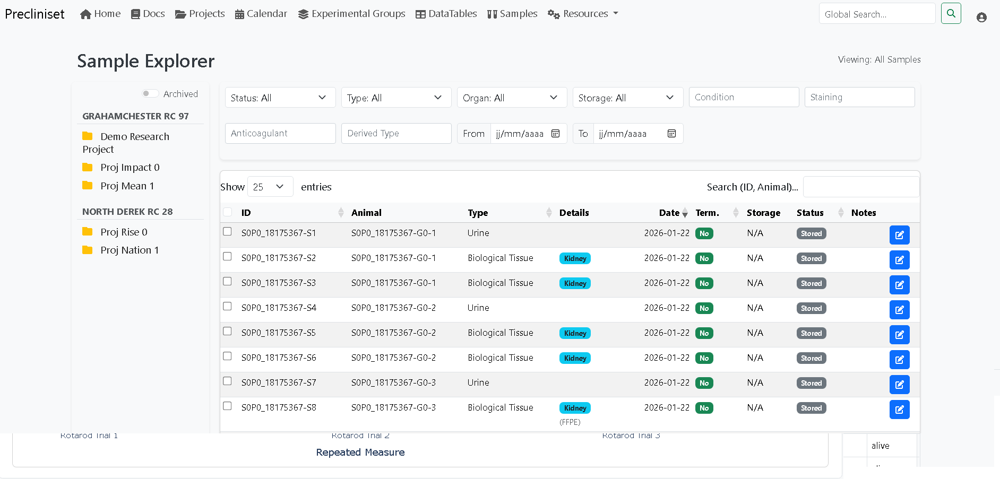

# Precliniset

**Precliniset** is a professional, open-source platform specifically designed to capture, store, analyze, and biobank data from preclinical research projects. It ensures data integrity, rigorous traceability, and seamless collaboration across scientific teams.


## 🌟 Key Features

### 🚀 Project & Study Management
Centralize your research. Manage studies with detailed metadata, team-based access controls, and external partner tracking.
- **Collaborative**: Share projects with other teams (view-only or edit access).
- **Secure**: Granular Role-Based Access Control (RBAC).


### 🔬 Experimental Design & Data Collection
Standardize your science.
- **Protocol Models**: Define reusable templates for measurements (e.g., *Rotarod*, *Non Invasive Blood Pressure*) that will include Analytes (e.g., *Rotarod Trial 1 (in sec.)*, *Body Weight*).
- **Groups**: Manage cohorts of animals linked to specific ethical approvals. Blinding of treatment groups.
- **DataTables**: Enter data via a web grid, Excel upload or raw data import with python scripts, with real-time validation.


### 📈 Built-in Analysis & Statistics
Instant insights. Precliniset can run statistical tests (ANOVA, t-test, Kruskal-Wallis) and generates figures to visualize your data.
- **Visuals**: Box plots, Violin plots, Time-course curves...
- **Stats**: Automated assumptions checking (Normality/homogeneity).


### 🧬 Biobanking (LIMS)
Track every sample.
- **Genealogy**: Link Primary samples (Tumor) to Derived samples (DNA, Slides) and their Animal source.
- **Storage**: Manage freezers, racks, and boxes.



### ⚖️ Ethics & Compliance (3Rs)
Stay compliant.
- **Real-time Tracking**: Monitor animal usage against your regulatory license (APAFIS/Protocol) limits.
- **Audit Trail**: Full GLP-compliant history of every data modification.
- **Apafis Import**: Directly import your xml files.
- **Ethical Guardrail**: Protocol severity is validated against the Ethical approval severity.
- **Statistics and retrospective**: Monitor your animal use and real severity per ethical approval.


### 🛡️ Security & Compliance
Built for sensitive data.
- **Strict Content Security Policy (CSP)**: Protection against XSS and injection attacks.
- **Input Sanitization**: Native protection against Excel Formula Injection (CSV injection).
- **SSRF Protection**: Hardened external requests with DNS validation.

### Additional Features
Built for a complete preclinical pipeline.
- **CKAN integration**: A Project can be uploaded in one click, including all data and metadata.
- **Controlled Molecules**: Track your molecule use per animal.
- **Reference Range**: Create data ranges based on your collected dataset, and use them to check your data on your figures.
- **Calendar**: User- and team-based calendars to track your protocols.

---

## 🛠️ Quick Start

Precliniset provides a unified CLI tool, `manage.py`, to handle the entire lifecycle.
Deployment can be done either natively (python and redis) or docker containers.

### 1. Installation
```bash
git clone https://github.com/precliniverse/precliniset
cd precliniset
```

### 2. Setup (Interactive Wizard)
Configure your environment (Database, Security, Email) with a guided wizard.
```bash
python manage.py --interactive
```

### 3. Deploy
Builds Docker containers (recommended) or installs native dependencies.
```bash
python manage.py deploy
```

### 4. Run
Start the services and access the application at `http://localhost:8000`.
```bash
python manage.py start
```

For detailed instructions, see **[DEPLOYMENT.md](DEPLOYMENT.md)**.

---

## 📚 Documentation
Full documentation is available in the `docs/` folder or by building the MkDocs site:
*   [Project Management](docs/features/projects.md)
*   [Experimental Groups & Import](docs/features/groups.md)
*   [Advanced Import Wizard](docs/features/import_wizard.md)
*   [Biobanking & Samples](docs/features/samples.md)
*   [Administration & API](docs/features/admin.md)

---

## 📜 License
This project is licensed under the **GNU Affero General Public License v3.0 (AGPLv3)**.
*   **Free for Open Source**: Modify and use freely for academic/community projects.
*   **Commercial**: Contact us for proprietary licensing if you cannot share your modifications.
