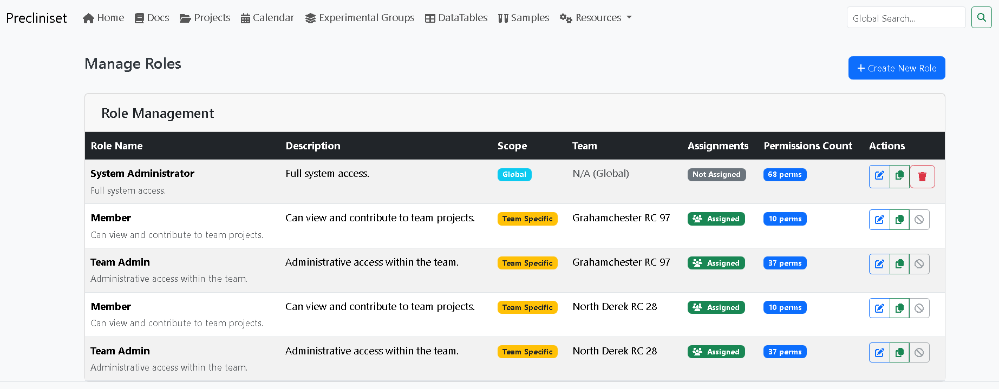

# System Administration

This guide is for **Super Admins** and **Team Admins**. It covers user management, system configuration, and data standardization.

[TOC]

## 1. User & Team Management

### The Hierarchy
*   **Super Admin**: Can manage *everything* (Users, All Teams, System Lists).
*   **Team Admin**: Can manage *their team* (Add members, Assign roles).
*   **Standard User**: Controlled by their assigned roles.

*Fig. Role management interface for defining team permissions.*

### Creating Users
1.  Navigate to **Admin** > **Users**.
2.  **Create User**.
3.  **Password Policy**: Recommends 12+ chars.

### Configuring Teams
Teams are the security boundaries of the system.
*   *Best Practice*: Create teams based on functional department (e.g., *In Vivo*, *Histology*, *Chemistry*) rather than temporary projects.

**Assigning Roles**:
| Role | Recommended For | Capabilities |
| :--- | :--- | :--- |
| **Team Admin** | Lab Managers | Manage members, Delete projects. |
| **Scientist** | Researchers | Create experiments, Upload data, Edit protocols. |
| **Technician** | Lab Techs | Data entry only (cannot alter study design). |
| **Viewer** | Guests/PIs | Read-only access to plots and reports. |

---

## 2. Standardization (Static Lists)
One of the biggest challenges in data science is "dirty data" (e.g., `bw`, `B.W.`, `Weight` all meaning the same thing).
Precliniset solves this by enforcing **Controlled Vocabularies**.

### Analytes (The Critical List)
An **Analyte** is a variable you measure.
*   Go to **Admin** > **Static Lists** > **Analytes**.
*   **Create New**:
    *   **Name**: *Body Weight* (Human readable).
    *   **Short Name**: *BW* (Used in column headers/plots).
    *   **Data Type**: *Numeric* (most common), *Text*, or *Boolean*.
    *   **Unit**: *g* (grams).

!!! note "Unit Consistency"
    Always define the base unit. If someone measures in `kg`, they must convert to `g` before upload, or the system will flag outliers.

### Other Lists
*   **Organs**: Standardize names (*Liver* vs *Hepar*).
*   **Sample Types**: Define physical forms (*Plasma*, *Serum*, *Whole Blood*).
*   **Stainings**: For histology metadata (*H&E*, *Masson's Trichrome*).

---

## 3. Data Auditing (GLP)

### The Audit Log
Every write action is logged.
*   **Go to**: **Admin** > **Audit Logs**.

### Filters & Export
*   **Scenario**: An auditor asks, *"Who modified the Tumor Volume for Animal #402 on June 12th?"*
    1.  Filter by **Target Type**: `ExperimentDataRow`.
    2.  Filter by **Date**: `June 12`.
    3.  **View Diff**: The log shows User X changed value `105` -> `150`.
*   **Export**: Click **Download CSV** for the full report.

## 4. System Maintenance
(See [Deployment Guide](../deployment.md))
*   **Backups**: Schedule database dumps via `manage.py` cron jobs.
*   **Updates**: Use `manage.py update` to apply security patches.
*   **Security Checks**: Regularly run `./scripts/security_check.sh` after updating dependencies to ensure no new vulnerabilities have been introduced.
