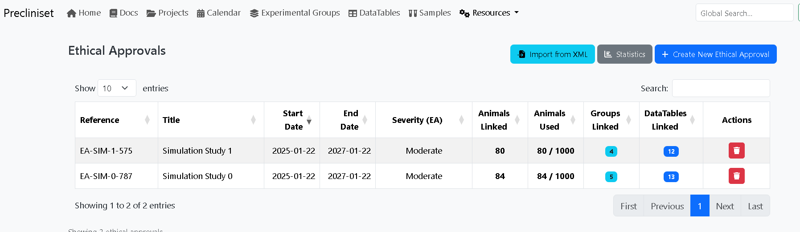

# Ethical Approvals (3Rs)

Precliniverse helps you stay compliant with animal welfare regulations (e.g., EU Directive 2010/63/EU, French APAFIS).

[TOC]

## 1. Concepts
An **Ethical Approval** (License/Protocol) authorizes you to use a specific number of animals for specific procedures.

*   **Quota**: The maximum authorized number (e.g., 500 mice).
*   **Expiration**: The date the license becomes invalid.

## 2. Managing Approvals

### Creation
1.  **Tab**: **Ethical Approvals**.
2.  **Import APAFIS**: If you have the XML file from the ministry, use this. It populates Title, Severity, and Counts automatically.
3.  **Manual**: Enter Title, Ref Number (e.g., `#23490`), and Limit.

### Monitoring Usage
How does the system count "Usage"?

1.  **Linked (Reserved)**:
    *   When you create an **Experimental Group**, you link it to an Approval.
    *   If the group has 10 animals planned, the system "Reserves" 10 slots.

*Fig. Tracking of animal usage against authorized 3Rs limits.*
    
2.  **Used (Actual)**:
    *   An animal changes status to "Used" when **actual data** is recorded for it (e.g., a Body Weight measurement).
    *   This distinguishes between "planned" experiments and "executed" experiments.

!!! warning "Threshold Alerts"
    The system displays a warning banner on the project page if the linked approval has used **>90%** of its quota.

## 3. Reporting
For annual regulatory reporting.

1.  Go to the **Ethical Approval** details page.
2.  **Export Statistics**: Detailed CSV breakdown.
    *   *Columns*: Species, Strain, Severity Classification, Number Used.
    *   You can copy-paste these tables directly into your regulatory submissions.
