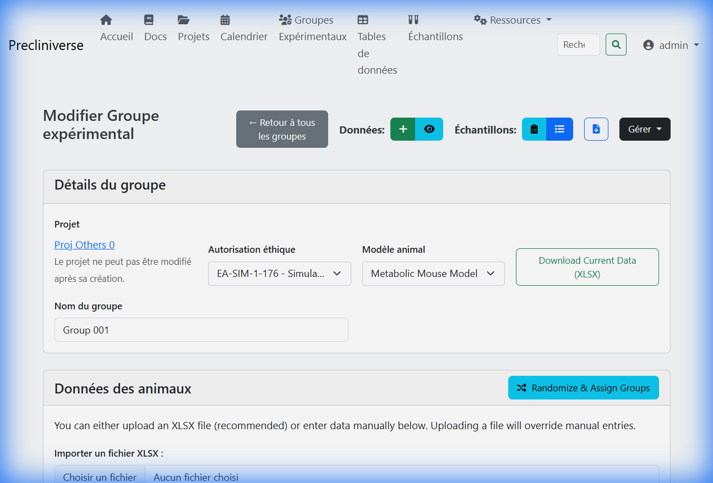
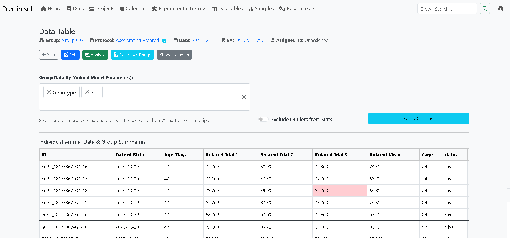
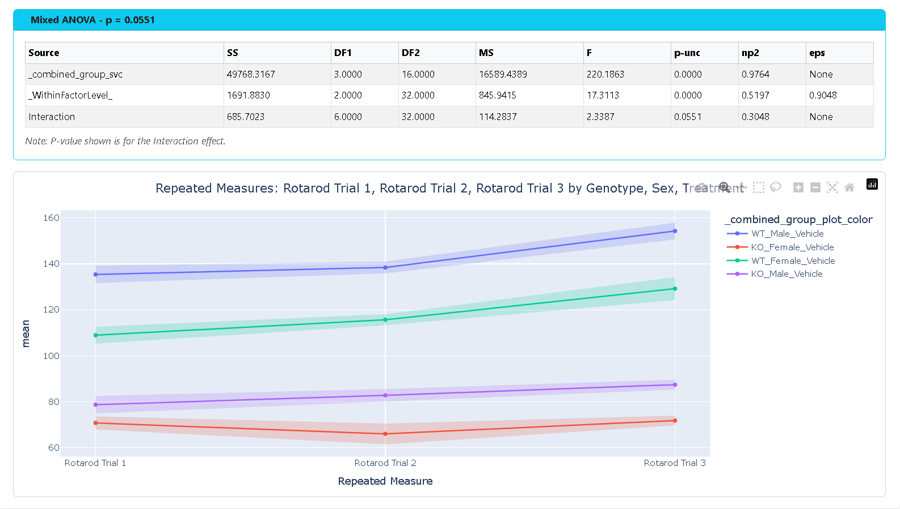

# Experimental Groups & Data Logic

This module manages the core scientific data. It connects the "Who" (Subjects), the "What" (Protocol), and the "When" (DataTables).

[TOC]

## 1. Experimental Groups (The "Who")
A **Group** is a container for subjects (Animals) that share a common condition.

### Setting Up a Group
1.  **Select Model**: You must choose an **Animal Model** (e.g., *Balb/c Mouse*). This defines the template (e.g., this model requires tracked `Body Weight` and `Tumor Origin`).
2.  **Naming**: Use descriptive names (e.g., *Group A - Vehicle*, *Group B - 10mg/kg*).
3.  **Color Coding**: Assign a color.
    *   *Advice*: This color will be used automatically in all plots and charts. Consistent color coding (Red for High Dose, Blue for Vehicle) makes reports easier to read.

### Adding Animals
You have two ways to populate a group:

*Fig. Experimental Group details showing animal list and metadata.*

#### Method A: Manual Entry
Good for small additions or replacements.
*   Click **Add Subject**.
*   Enter ID (e.g., `#401`), DOB, Sex.

#### Method B: Bulk Import (Recommended)
Good for starting a study (n=10, n=50).
1.  Click **Import Animals**.
2.  **Download Template**: Get the pre-formatted Excel file.
3.  Fill columns (`uid`, `date_of_birth`, `sex`, etc.).
4.  **Upload**: The system validates the data (e.g., checks for duplicate `uid`s).

---

## 2. DataTables (The "What" & "When")
A **DataTable** is a single data collection event.

### The Protocol Model
Before creating a table, you select a **Protocol Model**.
*   *Example*: "Subcutaneous Tumor Measurement".
*   *Contains*:
    *   **Analyte 1**: Length (mm)
    *   **Analyte 2**: Width (mm)
    *   **Calculation**: Volume = $0.5 \times Length \times Width^2$

!!! info "Flexibility"
    You define these models in the **Admin** panel once, and reuse them across thousands of experiments.

### Data Entry Modes
Once the table is created for a specific date (e.g., *Day 7*):

1.  **Web Grid**:
    *   Works like a spreadsheet in your browser.
    *   **Real-time Validation**: Turns red if you enter text in a number field.
    *   **Auto-Calculation**: Calculated fields (like Volume) update instantly as you type.

2.  **Excel Round-Trip**:
    *   **Step 1**: Click **Export Template**.
    *   **Step 2**: Take the Excel file to the lab (offline).
    *   **Step 3**: Fill it out on the bench.
    *   **Step 4**: **Import Data**. The system maps rows by Animal ID.

3.  **Advanced Import Wizard**:
    *   For messy raw data from instruments (CSVs/Excel) that doesn't follow a template.
    *   Supports row skipping, keywords anchoring, and formula-based transformations.
    *   See [Advanced Import Wizard](import_wizard.md) for a full guide.

4.  **Import Pipelines (Advanced)**:
    *   For extremely complex or proprietary formats.
    *   Allows using **custom Python scripts** (pandas, numpy, regex) to process reports.
    *   Provides a "One-Click" experience for end-users once configured.
    *   See [Import Pipelines](pipelines.md) for technical specifications.

*Fig. Real-time data entry grid with validation.*

---

## 3. Statistical Analysis
Precliniset embeds a statistical engine (using `scipy` and `statsmodels`).

### One-Click-Analysis
In any DataTable, click the **Analysis** tab.

**The Logic Flow**:
1.  **Normality Check**: Runs Shapiro-Wilk test on the data distribution.
2.  **Homogeneity Check**: Runs Levene’s test for equal variances.
3.  **Test Selection**:
    *   *Normal + Equal Variance* -> **One-way ANOVA**.
    *   *Non-Normal* -> **Kruskal-Wallis**.
    *   *Two Groups only* -> **T-test** or **Mann-Whitney**.

*Fig. Automated statistical analysis and plots.*

### Interpretation
The system provides a clear English summary:
> *"The difference between groups is Statistically Significant (p=0.003)."*

!!! warning "Scientist Review"
    Automated statistics are a powerful guide, but a scientist should always review the assumptions. You can export the raw data to Prism or R for advanced modeling (e.g., Mixed Models, Survival Curves).

## 4. Visualization
The **Plots** tab offers instant visualization.
*   **Box Plots**: Show median and quartiles.
*   **Violin Plots**: Show data density distribution.
*   **Time-Course**: (On Project Level) Aggregate multiple DataTables to see growth curves over time.
