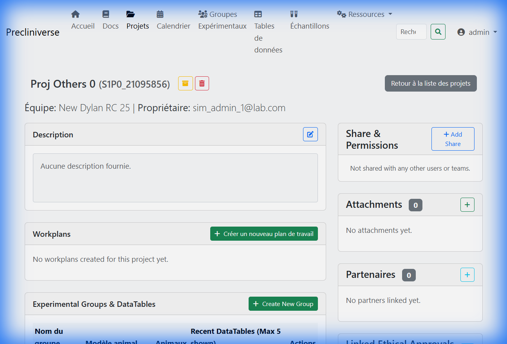
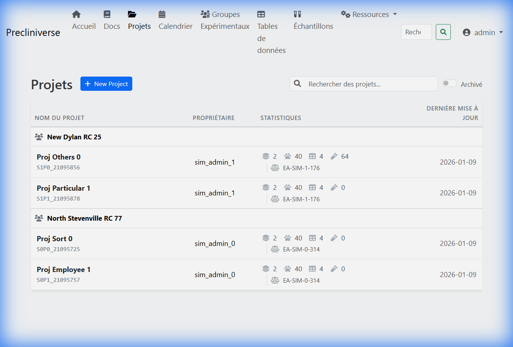

# Project Management

The **Project** is the fundamental container in Precliniset. It organizes your research into logical scientific units, ensuring that data is traceable, secure, and accessible only to the right people.

[TOC]

## 1. Creating a Project
Starting a new study begins here.

### The Creation Wizard
Navigate to **Projects** > **New Project** to open the creation dialog.

*   **Title**: Choose a unique, descriptive title (e.g., *'Efficacy of Compound ABC-123 in a 4T1 Murine Model'*).
*   **Description**: A high-level scientific summary. This is indexed for search, so include keywords here (Target, Compound, Mechanism).
*   **Ethical Approval**: Mandatory for animal studies. Select the active **APAFIS/License** authorizing this work.
    *   *Note*: This links the project to the regulatory limit tracking system.
*   **Start Date**: Defaults to today.

!!! tip "Naming Convention"
    adopt a standardize naming convention for your organization, such as `[Year]-[Dept]-[Compound]-[StudyID]`. Example: `2024-ONC-ABC123-001`.

---

## 2. The Project Dashboard
Once inside a project, you are presented with a tabbed interface.

*Fig. Project Dashboard showing workplans and experimental groups.*

### Overview Tab
The collaborative hub.
*   **Progress Tracking**: See the status (Active/Archived).
*   **Recent Activity**: A timeline of the latest data uploads or modifications.
*   **Documents**: Upload protocols, PDFs, or raw instrument outputs here.
    *   *Limit*: 50MB per file.

### Experimental Groups Tab
Access the specific cohorts of animals. (See [Groups & Data](groups.md) for details).

### Settings Tab
Restricted to **Project Owners** and **Team Admins**.
*   **Edit Metadata**: Change title/description.
*   **Archive Project**: Marks the project as read-only.
    *   *Use case*: When a study report is final, archive the project to prevent accidental data changes (GLP compliance).

---

## 3. Collaboration & Permissions
Precliniset uses a rigorous **Role-Based Access Control (RBAC)** system.

### Team Ownership
A project belongs primarily to a **Team** (e.g., "Pharmacology").
*   All members of the "Pharmacology" team with the **Viewer** role can see it.

*Fig. List of projects available to the user.*

*   Members with **Scientist** role can add data.
*   **Team Admins** can delete or archive it.

### Sharing "Cross-Team"
Research is multidisciplinary. You can share a project with another team without giving them full ownership.

**Example Scenario**:
> The **In Vivo** team owns the project and manages the animals. They need the **Histology** team to upload slide data.

1.  Go to **Settings** > **Sharing**.
2.  Click **Share with Team**.
3.  Select **Histology**.
4.  Choose Permission Level:
    *   **Can View**: Read-only access to plots and data.
    *   **Can Edit Data**: Allowed to fill DataTables (upload Excel).
    *   **Can Manage**: Allowed to create new Groups and DataTables.

!!! warning "Security"
    Sharing a project exposes *all* data within it to the target team. If you only want to share specific results, export the data instead.

---

## 4. External Partners
Track metadata about external collaborations.

If parts of your study are outsourced (e.g., PK analysis sent to a CRO), link the **Partner** in the project details.
*   This does **not** give the external partner access to the system.
*   It serves as an internal log for traceability (e.g., *"Why are samples missing? Sent to Charles River for Analysis"*).
